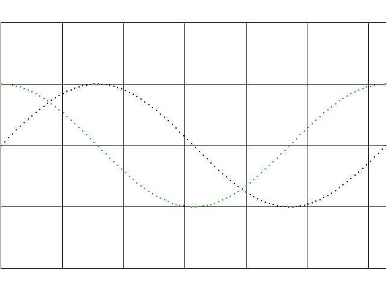

# OpenGL 2D plotting library



## Requirements

* `BSDmake` or `GNUmake` build automation tool
* `C++17` compiler
* [`OpenGL`](http://opengl.org) specification library
* [`Xlib`](http://x.org) library

## Build instructions

* `make`: builds library in default working directory `work`
* `make clean`: cleans working directory
* `make install`: installs library `libplot2d.a` and header `plot2d.hpp` into
    repository directory
* `make uninstall`: deletes `libplot2d.a` and `plot2d.hpp`
* `make tests`: builds tests in default working directory `work`

Build tunings should be done via make-variables:

* `COMP`: specifies compiler to use;
* `FLAGS`: defines additional compilation flags;
* `INCLUDE`: tunes include path;
* `LIB`: tunes lib path;
* `O`: sets working directory.

## Documentation

### Plot2D abstractions

```
Point(GLfloat x = 0, GLfloat y = 0);
```
The `Point` class encapsulates two-dimension coordinates of a plane point.

```
Color(GLfloat red = 0, GLfloat green = 0, GLfloat blue = 0, GLfloat alpha = 1);
```
The `Color` class encapsulates color of a plane point.

```
Viewport(
    const Point& left_bottom = Point(),
    const Point&   right_top = Point(), unsigned resolution = 0
);
```
The `Viewport` class encapsulates selected plane area where the graph will be
drawn and resolution (amount of points) of this drawing.

```
Func(const Color& c = Color());

typedef std::shared_ptr<Func> Pointer;

virtual Pointer copy() const = 0;
virtual double operator()(double x) const = 0;
```
The `Func` class encapsulates function to be drawn. This class is an abstract
class. User describes own descendant with realization of `copy()` (method for
creation `Pointer` to the new copy object) and `operator()` (method for function
realization).

```
typedef double (*FP)(double);

UsualFunc(FP fp, const Color& c = Color());
```
The `UsualFunc` class is a simple realization of inheritance from `Func`, where
function to be drawn is explicitly given (`FP` pointer). As a general matter the
descendant of `Func` may be more complicated (it can describe the
[Lagrange polinomial](http://en.wikipedia.org/wiki/Lagrange_polynomial) of a
certain function, for example).

```
FuncSet(const Viewport& vp = Viewport());

void add(const Func& f);
```
The `FuncSet` class encapsulates all functions to be drawn on a certain plane
area (`Viewport`). The method `add()` is used to add specific `Func` to the set.

```
FuncPack();

void add(const FuncSet& fs);
```
The `FuncPack` class encapsulates a union of all `FuncSet` objects the `Plotter`
will use.

```
Plotter(const char *name, const FuncPack& fp);

void loop();
```
The `Plotter` class encapsulates a plotter that will draw all given `FuncSet`
objects independently, with one view per object. The method `loop()` does all
work.

```
class Error : public std::exception

int code() const;
const char* msg() const;
const char* log() const;
void terminate(const char *heading) const;
```
During drawing process some fatal situations may occur. In this way exception
with `Error` class object will be thrown. The method `terminate()` outputs all
information and terminates the program.

### Keyboard commands

* `F1`-`F12`: change views
* `q` | `Esc`: exit
* `k` | `Up`: move up
* `j` | `Down`: move down
* `h` | `Left`: move left
* `l` | `Right`: move right
* `K` | `+`: zoom in
* `J` | `-`: zoom out

### Example

```
#include "../plot2d.hpp"
#include <cmath>

int main() {
    try {
        const Plot2D::Color blue(0, 0, 0.75);
        const Plot2D::Viewport vp(
            Plot2D::Point(0, -2), Plot2D::Point(2 * M_PI, 2), 100
        );

        Plot2D::FuncSet fs(vp);
        fs.add(Plot2D::UsualFunc(&sin, blue));
        Plot2D::FuncPack fp;
        fp.add(fs);

        Plot2D::Plotter p("Plot2D test: sin", fp);
        p.loop();
    }
    catch(const Plot2D::Error& err) {
        err.terminate("");
    }

    return 0;
}
```
